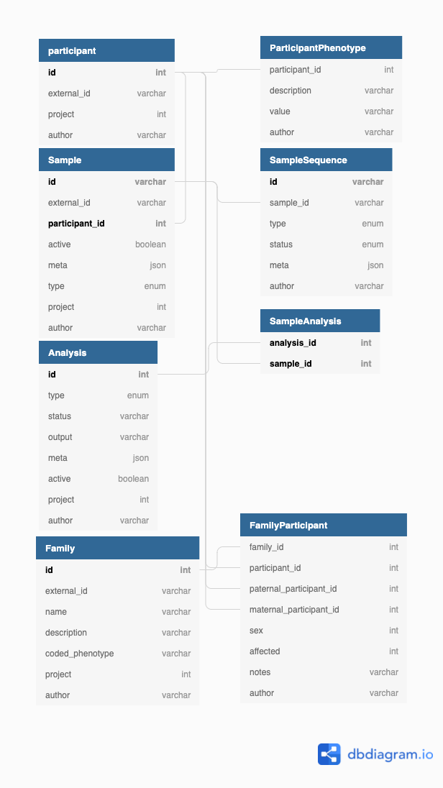

# Sample Metadata

[](https://codecov.io/gh/populationgenomics/sample-metadata)

The sample-metadata system is database that stores **de-identified** metadata.

There are three components to the sample-metadata system:

- System-versioned MariaDB database,
- Python web API to manage permissions, and store frequently used queries,
- An installable python library that wraps the Python web API (using OpenAPI generator)

Every resource in sample-metadata belongs to a project. All resources are access
controlled through membership of the google groups:
`$dataset-sample-metadata-main-{read,write}`. Note that members of google-groups
are cached in a secret as group-membership identity checks are slow.


## Structure



### Sample IDs

In an effort to reduce our dependency on potentially mutable external sample IDs with inconsistent format,
the sample-metadata server generates an internal sample id for every sample. Internally they're an
incrementing integer, but they're transformed externally to have a prefix, and checksum - this allows durability
when transcribing sample IDs to reduce mistypes, and allow to quickly check whether a sample ID is valid.

> NB: The prefix and checksums are modified per environment (production, development, local) to avoid duplicates from these environments.

For example, let's consider the production environment which uses the prefix of `CPG` and a checksum offset of 0:

> A sample is given the internal ID `12345`, we calculate the Luhn checksum to be `5` (with no offset applied).
> We can then concatenate the results, for the final sample ID to be `CPG123455`.

### Reporting sex

To avoid ambiguity in reporting of gender, sex and karyotype - the sample metadata system
stores these values separately on the `participant` as:

- `reported_gender` (string, expected `male` | `female` | _other values_)
- `reported_sex` (follows pedigree convention: `unknown=0 | null`, `male=1`, `female=2`)
- `inferred_karyotype` (string, eg: `XX` | `XY` | _other karyotypes)

If you import a pedigree, the sex value is written to the `reported_sex` attribute.

## Local develompent of SM

The recommended way to develop the sample-metadata system is to run a local copy of SM.
> There have been some reported issues of running a local SM environment on an M1 mac.

You can run MariaDB with a locally installed docker, or from within a docker container.
You can configure the MariaDB connection with environment variables.

### Creating the environment

Dependencies for the `sample-metadata` API package are listed in `setup.py`.
Additional dev requirements are listed in `requirements-dev.txt`, and packages for
the sever-side code are listed in `requirements.txt`.

To create the full dev environment, run:

```shell
virtualenv venv
source venv/bin/activate
pip install -r requirements.txt
pip install -r requirements-dev.txt
pip install --editable .
```

### Default DB set-up

These are the default values for the SM database connection.
Please alter them if you use any different values when setting up the database.

```shell
export SM_DEV_DB_USER=root
export SM_DEV_DB_PASSWORD= # empty password
export SM_DEV_DB_HOST=127.0.0.1
export SM_DEV_DB_PORT=3306 # default mariadb port
```

Create the database in MariaDB (by default, we call it `sm_dev`):

> Sample-metadata stores all metadata in one database (_previously: one database per project_).

```shell
mysql -u root --execute 'CREATE DATABASE sm_dev'
```

Download the `mariadb-java-client` and create the schema using liquibase:

```shell
pushd db/
wget https://repo1.maven.org/maven2/org/mariadb/jdbc/mariadb-java-client/2.7.2/mariadb-java-client-2.7.2.jar
liquibase \
    --changeLogFile project.xml \
    --url jdbc:mariadb://localhost/sm_dev \
    --driver org.mariadb.jdbc.Driver \
    --classpath mariadb-java-client-2.7.2.jar \
    --username root \
    update
popd
```

#### Using Maria DB docker image

Pull mariadb image

```bash
docker pull mariadb
```

Run a mariadb container that will server your database. `-p 3307:3306` remaps the port to 3307 in case if you local MySQL is already using 3306

```bash
docker stop mysql-p3307  # stop and remove if the container already exists
docker rm mysql-p3307
# run with an empty root password
docker run -p 3307:3306 --name mysql-p3307 -e MYSQL_ALLOW_EMPTY_PASSWORD=true -d mariadb
```

```bash
mysql --host=127.0.0.1 --port=3307 -u root -e 'CREATE DATABASE sm_dev;'
mysql --host=127.0.0.1 --port=3307 -u root -e 'show databases;'
```

Go into the `db/` subdirectory, download the `mariadb-java-client` and create the schema using liquibase:

```bash

pushd db/
wget https://repo1.maven.org/maven2/org/mariadb/jdbc/mariadb-java-client/2.7.2/mariadb-java-client-2.7.2.jar
liquibase \
    --changeLogFile project.xml \
    --url jdbc:mariadb://127.0.0.1:3307/sm_dev \
    --driver org.mariadb.jdbc.Driver \
    --classpath mariadb-java-client-2.7.2.jar \
    --username root \
    update
popd
```

Finally, make sure you configure the server (making use of the environment variables) to point it to your local Maria DB server

```bash
export SM_DEV_DB_PORT=3307
```


### Running the server

You'll want to set the following environment variables (permanently) in your
local development environment.

```shell
# ensures the SWAGGER page (localhost:8000/docs) points to your local environment
export SM_ENVIRONMENT=LOCAL
# skips permission checks in your local environment
export SM_ALLOWALLACCESS=true

# start the server
python3 -m api.server
# OR
# uvicorn --port 8000 --host 0.0.0.0 api.server:app
```

In a different terminal, execute the following
request to create a new project called 'dev'

```shell
curl -X 'PUT' \
  'http://localhost:8000/api/v1/project/?name=dev&dataset=dev&gcp_id=dev&create_test_project=false' \
  -H 'accept: application/json' \
  -H "Authorization: Bearer $(gcloud auth print-identity-token)"
```

#### Quickstart: Generate and install the installable API

It's best to do this with an already running server:

```shell
python3 regenerate_api.py \
    && pip install .
```

#### Debugging the server in VSCode

VSCode allows you to debug python modules, we could debug the web API at `api/server.py` by considering the following `launch.json`:

```json
{
    "version": "0.2.0",
    "configurations": [
        {
            "name": "API server",
            "type": "python",
            "request": "launch",
            "module": "api.server"
        }
    ]
}
```

We could now place breakpoints on the sample route (ie: `api/routes/sample.py`), and debug requests as they come in.

#### Developing the UI

```shell
# Ensure you have started sm locally on your computer already, then in another tab open the UI.
# This will automatically proxy request to the server.
cd web
npm install
npm start
```


#### Unauthenticated access

You'll want to set the `SM_LOCALONLY_DEFAULTUSER` environment variable along with `ALLOWALLACCESS` to allow access to a local sample-metadata server without providing a bearer token. This will allow you to test the front-end components that access data. This happens automatically on the production instance through the Google identity-aware-proxy.

```shell
export SM_ALLOWALLACCESS=1
export SM_LOCALONLY_DEFAULTUSER=$(whoami)
```

### OpenAPI and Swagger

The Web API uses `apispec` with OpenAPI3 annotations on each route to describe interactions with the server. We can generate a swagger UI and an installable
python module based on these annotations.

Some handy links:

- [OpenAPI specification](https://swagger.io/specification/)
- [Describing parameters](https://swagger.io/docs/specification/describing-parameters/)
- [Describing request body](https://swagger.io/docs/specification/describing-request-body/)
- [Media types](https://swagger.io/docs/specification/media-types/)

The web API exposes this schema in two ways:

- Swagger UI: `http://localhost:8000/docs`
    - You can use this to construct requests to the server
    - Make sure you fill in the Bearer token (at the top right )
- OpenAPI schema: `http://localhost:8000/schema.json`
    - Returns a JSON with the full OpenAPI 3 compliant schema.
    - You could put this into the [Swagger editor](https://editor.swagger.io/) to see the same "Swagger UI" that `/api/docs` exposes.
    - We generate the sample_metadata installable Python API based on this schema.

#### Generating the installable API

The installable API is automatically generated through the `package.yml` GitHub action and uploaded to PyPI.


To generate the python api you'll need to install openapi generator v5.x.x

```bash
brew install openapi-generator
```


You could generate the installable API and install it with pip by running:

```bash
# this will start the api.server, so make sure you have the dependencies installed,
python regenerate_api.py \
    && pip install .
```

Or you can build the docker file, and specify that

```bash
# SM_DOCKER is a known env variable to regenerate_api.py
export SM_DOCKER="cpg/sample-metadata-server:dev"
docker build --build-arg SM_ENVIRONMENT=local -t $SM_DOCKER -f deploy/api/Dockerfile .
python regenerate_apy.py
```


## Deployment

The sample-metadata server

You'll want to complete the following steps:

- Ensure there is a database created for each project (with the database name being the project),
- Ensure there are secrets in `projects/sample_metadata/secrets/databases/versions/latest`, that's an array of objects with keys `dbname, host, port, username, password`.
- Ensure `google-cloud` was installed

```bash
export SM_ENVIRONMENT='PRODUCTION'

# OR, point to the dev instance with
export SM_ENVIRONMENT='DEVELOPMENT'

```
