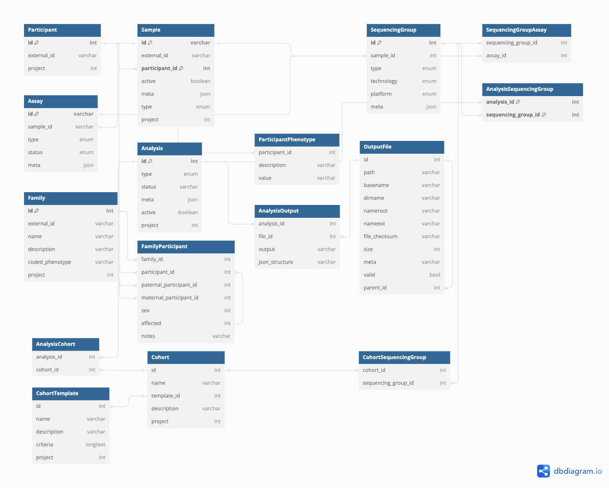

# Metamist

## Introduction

**Metamist** is a database designed for storing **de-identified** -omics metadata.

## Purpose

The project provides an interface to interact with the -omics database via the Python client as well as the GraphQL + HTTP APIs.

## Features

- **Project-Based Resource Organization**: Every resource in Metamist is associated with a specific project.
- **Access Control**: Access to resources is controlled through membership in specific Google Groups:
  - `dataset-sample-metadata-main-read`: For read-only access.
  - `dataset-sample-metadata-main-write`: For write access.
- **Efficiency Note**: Members of Google Groups are cached in a blob to optimize performance, as group-membership identity lookups can be slow.

## High-Level Architecture

It comprises three key components:

1. **System-Versioned MariaDB Database**: A robust database system for managing -omics metadata.

2. **Python Web API**: This component is responsible for:
   - Managing permissions.
   - Storing frequently used queries.
   - Providing a GraphQL/HTTP API for efficient querying of the database.

3. **Installable Python Library**: Wraps the Python Web API using the OpenAPI generator, facilitating easier interaction with the system.

### Schema

As of Jan 15, 2024 this schema should reflect the data structure on the tables:

You can also find this at [DbDiagram](https://dbdiagram.io/d/Metamist-Schema-v7-7-6600c875ae072629ced6a1fc).

The codebase contains the following modules worth noting:

- `models` -> General data models + enums
- `db/python/tables` -> Interaction with MariaDB / BigQuery
- `db/python/layers` -> Logic
- `api/graphql` : GraphQL
- `api/routes`: HTTP + OpenAPI

And metamist maintains two clients:

- `web`  -> React app that consumes a generated Typescript API + GraphQL
- `metamist` -> autogenerated Python API

## Installation and Running Locally

- [Installation and developer setup](docs/installation.md)

## License

This project is licensed under the MIT License. You can see it in the [LICENSE](LICENSE) file in the root directory of this source tree.
