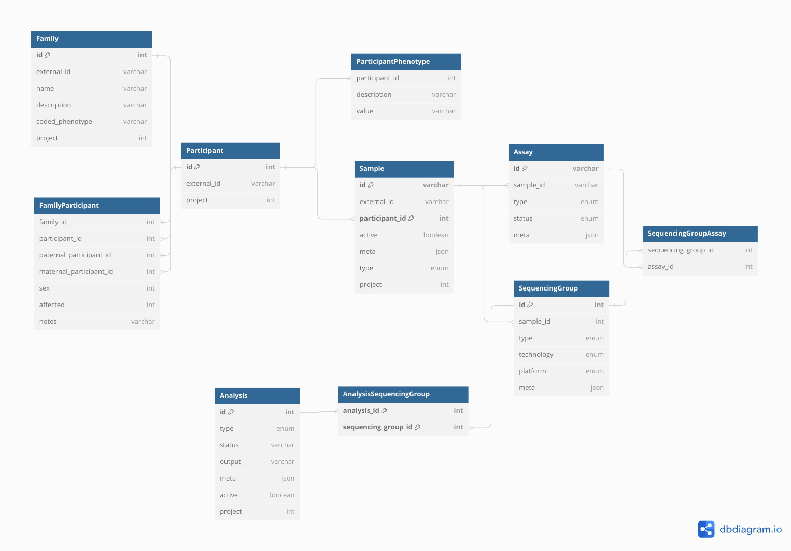

# Metamist

[](https://codecov.io/gh/populationgenomics/metamist)


## Introduction

**Metamist** is a database designed for storing **de-identified** -omics metadata.

## Purpose

The project provides an interface to interact with the -omics database via the Python client as well as the GraphQL + HTTP APIs.

## Features

- **Project-Based Resource Organization**: Every resource in Metamist is associated with a specific project.
- **Access Control**: Access to resources is controlled through membership in specific Google Groups:
  - `dataset-sample-metadata-main-read`: For read-only access.
  - `dataset-sample-metadata-main-write`: For write access.
- **Efficiency Note**: Members of Google Groups are cached in a blob to optimize performance, as group-membership identity lookups can be slow.

## High-Level Architecture

It comprises three key components:

1. **System-Versioned MariaDB Database**: A robust database system for managing -omics metadata.

2. **Python Web API**: This component is responsible for:
   - Managing permissions.
   - Storing frequently used queries.
   - Providing a GraphQL/HTTP API for efficient querying of the database.

3. **Installable Python Library**: Wraps the Python Web API using the OpenAPI generator, facilitating easier interaction with the system.

### Schema

As of Jan 15, 2024 this schema should reflect the data structure on the tables:



You can also find this at [DbDiagram](https://dbdiagram.io/d/Metamist-Schema-v6-6-2-65a48ac7ac844320aee60d16).

The codebase contains the following modules worth noting:

- `models` -> General data models + enums
- `db/python/tables` -> Interaction with MariaDB / BigQuery
- `db/python/layers` -> Logic
- `api/graphql` : GraphQL
- `api/routes`: HTTP + OpenAPI

And metamist maintains two clients:

- `web`  -> React app that consumes a generated Typescript API + GraphQL
- `metamist` -> autogenerated Python API

## Installation and Running Locally

- [Installation and developer setup](docs/installation.md)

## License

The recommended way to develop the metamist system is to run a local copy of SM.

> There have been some reported issues of running a local SM environment on an M1 mac.

You can run MariaDB with a locally installed docker, or from within a docker container.
You can configure the MariaDB connection with environment variables.

### Creating the environment

Python dependencies for the `metamist` API package are listed in `setup.py`.
Additional dev requirements are listed in `requirements-dev.txt`, and packages for
the sever-side code are listed in `requirements.txt`.

We _STRONGLY_ encourage the use of `pyenv` for managing Python versions.
Debugging and the server will run on a minimum python version of 3.10.

To setup the python environment, you can run:

```shell
virtualenv venv
source venv/bin/activate
pip install -r requirements.txt
pip install -r requirements-dev.txt
pip install --editable .
```

### Extra software

You'll need to install the following software to develop metamist:

- Node / NPM (recommend using nvm)
- MariaDB (using MariaDB in docker is also good)
- Java (for liquibase / openapi-generator)
- Liquibase
- OpenAPI generator
- wget (optional)

Our recommendation is in the following code block:

```shell
brew install wget
brew install java
brew install liquibase
```

Add the following to your `.zshrc` file:

```shell

# homebrew should export this on an M1 Mac
# the intel default is /usr/local
export HB_PREFIX=${HOMEBREW_PREFIX-/usr/local}

# installing Java through brew recommendation
export CPPFLAGS="-I$HB_PREFIX/opt/openjdk/include"

# installing liquibase through brew recommendation
export LIQUIBASE_HOME=$(brew --prefix)/opt/liquibase/libexec

export PATH="$HB_PREFIX/bin:$PATH:$HB_PREFIX/opt/openjdk/bin"
```

#### Node through node-version manager (nvm)

We aren't using too many node-specific features, anything from 16 should work fine,
this will install the LTS version:

```shell
brew install nvm

# you may need to add the the following to your .zshrc
# export NVM_DIR="$HOME/.nvm"
# [ -s "$HB_PREFIX/opt/nvm/nvm.sh" ] && \. "$HB_PREFIX/opt/nvm/nvm.sh"  # This loads nvm
# [ -s "$HB_PREFIX/opt/nvm/etc/bash_completion.d/nvm" ] && \. "$HB_PREFIX/opt/nvm/etc/bash_completion.d/nvm"  # This loads nvm bash_completion

# install latest version of node + npm
nvm install --lts
```

#### OpenAPI generator

You'll need this to generate the Python and Typescript API.

```shell
npm install @openapitools/openapi-generator-cli -g
openapi-generator-cli version-manager set 5.3.0

# put these in your .zshrc
export OPENAPI_COMMAND="npx @openapitools/openapi-generator-cli"
alias openapi-generator="npx @openapitools/openapi-generator-cli"
```

#### MariaDB install

If you're planning to install MariaDB locally, brew is the easiest:

```shell

brew install mariadb@10.8
# start mariadb on computer start
brew services start mariadb@10.8

# make mariadb command available on path
export PATH="$HB_PREFIX/opt/mariadb@10.8/bin:$PATH"
```

#### Your .zshrc file

If you installed all the software through brew and npm
like this guide suggests, your `.zshrc` may look like this:

```shell
alias openapi-generator="npx @openapitools/openapi-generator-cli"

# homebrew should export this on an M1 Mac
# the intel default is /usr/local
export HB_PREFIX=${HOMEBREW_PREFIX-/usr/local}

# metamist
export SM_ENVIRONMENT=LOCAL # good default to have
export SM_DEV_DB_USER=sm_api # makes it easier to copy liquibase update command
export OPENAPI_COMMAND="npx @openapitools/openapi-generator-cli"

export PATH="$HB_PREFIX/bin:$HB_PREFIX/opt/mariadb@10.8/bin:$PATH:$HB_PREFIX/opt/openjdk/bin"

export CPPFLAGS="-I$HB_PREFIX/opt/openjdk/include"
export LIQUIBASE_HOME=$(brew --prefix)/opt/liquibase/libexec

# node
export NVM_DIR="$HOME/.nvm"
[ -s "$HB_PREFIX/opt/nvm/nvm.sh" ] && \. "$HB_PREFIX/opt/nvm/nvm.sh"  # This loads nvm
[ -s "$HB_PREFIX/opt/nvm/etc/bash_completion.d/nvm" ] && \. "$HB_PREFIX/opt/nvm/etc/bash_completion.d/nvm"  # This loads nvm bash_completion
```

### Database setup

These are the default values for the SM database connection.
Please alter them if you use any different values when setting up the database.

```shell
export SM_DEV_DB_USER=root    # this is the default, but we now recommend sm_api
export SM_DEV_DB_PASSWORD= # empty password
export SM_DEV_DB_HOST=127.0.0.1
export SM_DEV_DB_PORT=3306 # default mariadb port
export SM_DEV_DB_NAME=sm_dev;
```

Create the database in MariaDB (by default, we call it `sm_dev`):

> In newer installs of MariaDB, the root user is protected by default.

We'll setup a user called `sm_api`, and setup permissions

```shell
sudo mysql -u root --execute "
  CREATE DATABASE sm_dev;
  CREATE USER sm_api@'%';
  CREATE USER sm_api@localhost;
  CREATE ROLE sm_api_role;
  GRANT sm_api_role TO sm_api@'%';
  GRANT sm_api_role TO sm_api@localhost;
  SET DEFAULT ROLE sm_api_role FOR sm_api@'%';
  SET DEFAULT ROLE sm_api_role FOR sm_api@localhost;
  GRANT ALL PRIVILEGES ON sm_dev.* TO sm_api_role;
"
```

Then, before you run you'll need to export the varied:

```shell
# also put this in your .zshrc
export SM_DEV_DB_USER=sm_api
```

Download the `mariadb-java-client` and create the schema using liquibase:

```shell
pushd db/
wget https://repo1.maven.org/maven2/org/mariadb/jdbc/mariadb-java-client/3.0.3/mariadb-java-client-3.0.3.jar
liquibase \
    --changeLogFile project.xml \
    --url jdbc:mariadb://localhost/sm_dev \
    --driver org.mariadb.jdbc.Driver \
    --classpath mariadb-java-client-3.0.3.jar \
    --username ${SM_DEV_DB_USER:-root} \
    update
popd
```

#### Using Maria DB docker image

Pull mariadb image

```bash
docker pull mariadb:10.8.3
```

If you wish, install the mysql-client using homebrew (or an equivalent linux command) so you can connect to the MariaDB server running via Docker:

```bash
brew install mysql-client
```

Run a mariadb container that will server your database. `-p 3307:3306` remaps the port to 3307 in case if you local MySQL is already using 3306

```bash
docker stop mysql-p3307  # stop and remove if the container already exists
docker rm mysql-p3307
# run with an empty root password
docker run -p 3307:3306 --name mysql-p3307 -e MYSQL_ALLOW_EMPTY_PASSWORD=true -d mariadb:10.8.3
```

```bash
mysql --host=127.0.0.1 --port=3307 -u root -e 'CREATE DATABASE sm_dev;'
mysql --host=127.0.0.1 --port=3307 -u root -e 'show databases;'
```

Similar to the previous section, we need to create the `sm_api` user, and set the corect roles and privileges:

```bash
mysql --host=127.0.0.1 --port=3307 -u root --execute "
  CREATE USER sm_api@'%';
  CREATE USER sm_api@localhost;
  CREATE ROLE sm_api_role;
  GRANT sm_api_role TO sm_api@'%';
  GRANT sm_api_role TO sm_api@localhost;
  SET DEFAULT ROLE sm_api_role FOR sm_api@'%';
  SET DEFAULT ROLE sm_api_role FOR sm_api@localhost;
  GRANT ALL PRIVILEGES ON sm_dev.* TO sm_api_role;
"
```

Go into the `db/` subdirectory, download the `mariadb-java-client` and create the schema using liquibase:

```bash
pushd db/
wget https://repo1.maven.org/maven2/org/mariadb/jdbc/mariadb-java-client/3.0.3/mariadb-java-client-3.0.3.jar
liquibase \
    --changeLogFile project.xml \
    --url jdbc:mariadb://127.0.0.1:3307/sm_dev \
    --driver org.mariadb.jdbc.Driver \
    --classpath mariadb-java-client-3.0.3.jar \
    --username root \
    update
popd
```

Finally, make sure you configure the server (making use of the environment variables) to point it to your local Maria DB server

```bash
export SM_DEV_DB_PORT=3307
```

### Running the server

You'll want to set the following environment variables (permanently) in your
local development environment.

The `SM_LOCALONLY_DEFAULTUSER` environment variable along with `ALLOWALLACCESS` to allow access to a local metamist server without providing a bearer token. This will allow you to test the front-end components that access data. This happens automatically on the production instance through the Google identity-aware-proxy.

```shell
export SM_ALLOWALLACCESS=1
export SM_LOCALONLY_DEFAULTUSER=$(whoami)
```

```shell
# ensures the SWAGGER page points to your local: (localhost:8000/docs)
# and ensures if you use the PythonAPI, it also points to your local
export SM_ENVIRONMENT=LOCAL
# skips permission checks in your local environment
export SM_ALLOWALLACCESS=true
# uses your username as the "author" in requests
export SM_LOCALONLY_DEFAULTUSER=$(whoami)

# probably need this


# start the server
python3 -m api.server
# OR
# uvicorn --port 8000 --host 0.0.0.0 api.server:app
```

#### Running + debugging in VSCode

The following `launch.json` is a good base to debug the web server in VSCode:

```json
{
  "version": "0.2.0",
  "configurations": [
    {
      "name": "Run API",
      "type": "python",
      "request": "launch",
      "module": "api.server",
      "justMyCode": false,
      "env": {
        "SM_ALLOWALLACCESS": "true",
        "SM_LOCALONLY_DEFAULTUSER": "<user>-local",
        "SM_ENVIRONMENT": "local",
        "SM_DEV_DB_USER": "sm_api"
      }
    }
  ]
}
```

We could now place breakpoints on the sample route (ie: `api/routes/sample.py`), and debug requests as they come in.

Then in VSCode under the _Run and Debug_ tab (⌘⇧D), you can "Run API":


#### Quickstart: Generate and install the python installable API

Generating the installable APIs (Python + Typescript) involves running
the server, getting the `/openapi.json`, and running `openapi-generator`.

The `regenerate_api.py` script does this in a few ways:

1. Uses a running server on `localhost:8000`
2. Runs a docker container from the `SM_DOCKER` environment variable
3. Spins up the server itself

Most of the time, you'll use 1 or 3:

```bash
# this will start the api.server, so make sure you have the dependencies installed,
python regenerate_api.py \
    && pip install .
```

If you'd prefer to use the Docker approach (eg: on CI), this command
will build the docker container and supply it to regenerate_api.py.

```bash
# SM_DOCKER is a known env variable to regenerate_api.py
export SM_DOCKER="cpg/metamist-server:dev"
docker build --build-arg SM_ENVIRONMENT=local -t $SM_DOCKER -f deploy/api/Dockerfile .
python regenerate_api.py
```

#### Generating example data

> You'll need to generate the installable API before running this step

You can run the `generate_data.py` script to generate some
random data to look at.

```shell
export SM_ENVIRONMENT=local # important
python test/data/generate_data.py
```

#### Developing the UI

```shell
# Ensure you have started sm locally on your computer already, then in another tab open the UI.
# This will automatically proxy request to the server.
cd web
npm install
npm run compile
npm start
```

This will start a web server using Vite, running on [localhost:5173](http://localhost:5173).

### OpenAPI and Swagger

The Web API uses `apispec` with OpenAPI3 annotations on each route to describe interactions with the server. We can generate a swagger UI and an installable
python module based on these annotations.

Some handy links:

- [OpenAPI specification](https://swagger.io/specification/)
- [Describing parameters](https://swagger.io/docs/specification/describing-parameters/)
- [Describing request body](https://swagger.io/docs/specification/describing-request-body/)
- [Media types](https://swagger.io/docs/specification/media-types/)

The web API exposes this schema in two ways:

- Swagger UI: `http://localhost:8000/docs`
  - You can use this to construct requests to the server
  - Make sure you fill in the Bearer token (at the top right )
- OpenAPI schema: `http://localhost:8000/schema.json`
  - Returns a JSON with the full OpenAPI 3 compliant schema.
  - You could put this into the [Swagger editor](https://editor.swagger.io/) to see the same "Swagger UI" that `/api/docs` exposes.
  - We generate the metamist installable Python API based on this schema.

## Deployment

The CPG deploy is managed through Cloud Run on the Google Cloud Platform.
The deploy github action builds the container, and is deployed.

Additionally you can access metamist through the identity-aware proxy (IAP),
which handles the authentication through OAuth, allowing you to access the
front-end.
This project is licensed under the MIT License. You can see it in the [LICENSE](LICENSE) file in the root directory of this source tree.
