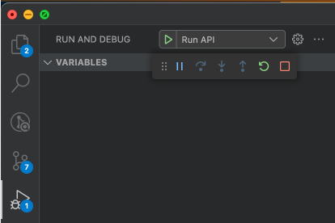

# Installation

This document provides detailed instructions on how to install the project. Follow these steps to set up the project on your local system.

## Prerequisites

[Homebrew](https://brew.sh) is the simplest way to install system dependencies needed for this project.

[Chocolatey](https://community.chocolatey.org/) is a good equivalent to Homebrew for package management in Windows.

## System Requirements


- **Node/NPM** (recommend using [pnpm](https://pnpm.io/motivation) for this, but you can also use [nvm](https://github.com/nvm-sh/nvm))
- **MariaDB** (using MariaDB in docker is also good)
- **Java** (for Liquibase / OpenAPI  Generator)
- **Liquibase**
- **OpenAPI Generator**
- **pyenv**
- **wget** *(optional)*

### Mac

```bash
brew install pnpm # recommended over nvm
# OR
brew install nvm

brew install java
brew install liquibase
brew install pyenv
brew install wget

# skip if you wish to install via docker
brew install mariadb@11.7.2

```

### Windows

Instructions for Windows should theoretically work but we have only tested this project to work on -nix systems. As such, we are unable to verify any discrepancies on Windows, and there could be slight variations in your setup.

```bash
# Assuming you have Chocolatey
choco install pnpm # Recommended
# OR
choco install nvm

choco install jdk8
choco install liquibase
choco install pyenv-win
choco install wget

# skip if you wish to install via docker
choco install mariadb --version=11.7.2
```

## Installation Steps

### Creating the environment

- Python dependencies for the `metamist` API package are listed in `setup.py`.
- Additional dev requirements are listed in `requirements-dev.txt`.
- Packages for the sever-side code are listed in `requirements.txt`.

We *STRONGLY* encourage the use of `pyenv` for managing Python versions. Debugging and the server will run on a minimum python version of 3.11. Refer to the [team-docs](https://github.com/populationgenomics/team-docs/blob/main/python.md) for more instructions on how to set this up.

Use of a virtual environment to contain all requirements is highly recommended:

```bash
virtualenv venv
source venv/bin/activate
pip install -r requirements.txt -r requirements-dev.txt

# Installs metamist as a package
pip install --editable .
```

You will also need to set the following environment variables. Adjust the paths if you installed the dependencies using an alternate means:

```bash
# homebrew should export this on an M1 Mac
# the intel default is /usr/local
export HB_PREFIX=${HOMEBREW_PREFIX-/usr/local}

# installing Java through brew recommendation
export CPPFLAGS="-I$HB_PREFIX/opt/openjdk/include"
export PATH="$HB_PREFIX/bin:$PATH:$HB_PREFIX/opt/openjdk/bin"

# installing liquibase through brew recommendation
export LIQUIBASE_HOME=$(brew --prefix)/opt/liquibase/libexec

# mariadb
export PATH="$HB_PREFIX/opt/mariadb@10.8/bin:$PATH"

# metamist config
export SM_ENVIRONMENT=LOCAL # good default to have
export SM_DEV_DB_USER=sm_api # makes it easier to copy liquibase update command

```

You can also add these to your shell config file e.g `.zshrc` or `.bashrc` for persistence to new sessions.

#### PNPM/NVM Config

Depending on your choice for using `pnpm` or `nvm` you will have to configure your shell for it.

If you installed `pnpm`, you should have a similar snippet from the brew installation output:

```shell
export PNPM_HOME="/Users/$(whoami)/Library/pnpm"
case ":$PATH:" in
  *":$PNPM_HOME:"*) ;;
  *) export PATH="$PNPM_HOME:$PATH" ;;
esac
```

Add this to your `.zshrc` to auto-load on next shell session.

If you installed `nvm`, you will need to add lazy load since `nvm` has high load penalties.

- For Oh-My-Zsh users, you can just add the `nvm` plugin to your `.zshrc` via these [instructions](https://github.com/ohmyzsh/ohmyzsh/blob/master/plugins/nvm/README.md)

- If you do NOT have Oh-My-Zsh, you can use this [plugin](https://github.com/undg/zsh-nvm-lazy-load):

```shell
git clone https://github.com/undg/zsh-nvm-lazy-load $ZSH/custom/plugins/zsh-nvm

#Add this to your plugins variable in the `.zshrc` file and then source the file.
plugins=(... zsh-nvm-lazy-load)
```

Once set up, install the OpenAPI Generator:

- For `pnpm`:

```shell
# Install npm via pnpm
# This also activates the env for you, replace `use` with `add` to only install it.
pnpm env use --global lts
pnpm install @openapitools/openapi-generator-cli -g
```

Add this to your `.zshrc`:

```shell
# openapi
export OPENAPI_COMMAND="pnpm dlx @openapitools/openapi-generator-cli"
alias openapi-generator="pnpm dlx @openapitools/openapi-generator-cli"
```

- For `nvm`:

```shell
# Install npm via nvm
nvm install --lts
npm install @openapitools/openapi-generator-cli -g
```

Add this to your `.zshrc`:

```shell
# openapi
export OPENAPI_COMMAND="npx @openapitools/openapi-generator-cli"
alias openapi-generator="npx @openapitools/openapi-generator-cli"
```

Finally, set the version:

```shell
openapi-generator-cli version-manager set 5.3.0
```

### Database Setup - Native Installation

Set the following environment variables:

```bash
export SM_DEV_DB_USER=sm_api
export SM_DEV_DB_PASSWORD= # empty password
export SM_DEV_DB_HOST=127.0.0.1
export SM_DEV_DB_PORT=3306 # default mariadb port
export SM_DEV_DB_NAME=sm_dev;
```

Next, create the database `sm_dev` in MariaDB.

> In newer versions of MariaDB, the root user is protected.

Create a new user `sm_api` and provide permissions:

```bash
sudo mysql -u root --execute "
  CREATE DATABASE sm_dev;
  CREATE USER sm_api@'%';
  CREATE USER sm_api@localhost;
  CREATE ROLE sm_api_role;
  GRANT sm_api_role TO sm_api@'%';
  GRANT sm_api_role TO sm_api@localhost;
  SET DEFAULT ROLE sm_api_role FOR sm_api@'%';
  SET DEFAULT ROLE sm_api_role FOR sm_api@localhost;
  GRANT ALL PRIVILEGES ON sm_dev.* TO sm_api_role;
"
```

Using `liquibase` we can now set up the tables as per the schema in `db/project.xml`:

```bash
pushd db/
wget https://repo1.maven.org/maven2/org/mariadb/jdbc/mariadb-java-client/3.0.3/mariadb-java-client-3.0.3.jar
liquibase \
    --changeLogFile project.xml \
    --url jdbc:mariadb://localhost/sm_dev \
    --driver org.mariadb.jdbc.Driver \
    --classpath mariadb-java-client-3.0.3.jar \
    --username ${SM_DEV_DB_USER:-root} \
    update
popd
```

### Database Setup - Docker Installation

Ensure you have Docker installed or follow [this guide](https://docs.docker.com/engine/install/) to setup.

Pull the image:

```bash
docker pull mariadb:10.8.3
```

Run the container on port 3306:

```bash
docker run --name mariadb-p3306 -e MYSQL_ALLOW_EMPTY_PASSWORD=1 -p 3306:3306 -d docker.io/library/mariadb:10.8.3
```

If you have a local MySQL instance already running on port 3306, you can map the docker container to run on 3307:

```bash
docker run --name mariadb-p3307 -e MYSQL_ALLOW_EMPTY_PASSWORD=1 -p 3307:3306 -d docker.io/library/mariadb:10.8.3
```

You can now execute bash commands inside a shell:

```bash
docker exec -it mariadb-p3306 bash
```

Set up the database with the `sm_api` user and appropriate permissions:

```bash
mysql -u root --execute "
  CREATE DATABASE sm_dev;
  CREATE USER sm_api@'%';
  CREATE USER sm_api@localhost;
  CREATE ROLE sm_api_role;
  GRANT sm_api_role TO sm_api@'%';
  GRANT sm_api_role TO sm_api@localhost;
  SET DEFAULT ROLE sm_api_role FOR sm_api@'%';
  SET DEFAULT ROLE sm_api_role FOR sm_api@localhost;
  GRANT ALL PRIVILEGES ON sm_dev.* TO sm_api_role;
"
```

Exit the container bash shell once done and on the host, run liquibase with the correct port mapping to set up the tables:

```bash
pushd db/
wget https://repo1.maven.org/maven2/org/mariadb/jdbc/mariadb-java-client/3.0.3/mariadb-java-client-3.0.3.jar
liquibase \
    --changeLogFile project.xml \
    --url jdbc:mariadb://127.0.0.1:3306/sm_dev \
    --driver org.mariadb.jdbc.Driver \
    --classpath mariadb-java-client-3.0.3.jar \
    --username root \
    update
popd
```

Ensure the database port environment variable matches the mapping above:

```bash
export SM_DEV_DB_PORT=3306 # or 3307
```

## Running the server

You'll want to set the following environment variables (permanently) in your local development environment.

The `SM_ENVIRONMENT` and `SM_LOCALONLY_DEFAULTUSER` environment variables allow access to a local metamist server without providing a bearer token.

This will allow you to test the front-end components that access data. This happens automatically on the production instance through the Google identity-aware-proxy.

```bash
# ensures the SWAGGER page points to your local: (localhost:8000/docs)
# and ensures if you use the PythonAPI, it also points to your local
export SM_ENVIRONMENT=LOCAL
# uses your username as the "author" in requests
export SM_LOCALONLY_DEFAULTUSER=$(whoami)
```

First start up your mysql server if it's not already running. 
```mysql.server start```

Enter the mysql command prompt
```mysql```

Switch your database to sm_dev
```USE sm_dev;```

To allow the system to be bootstrapped and create the initial project, you'll need to add yourself to the two admin groups that allow creating projects and updating project members:

```sql
INSERT INTO group_member(group_id, member)
SELECT id, '<your local username>'
FROM `group` WHERE name IN('project-creators', 'members-admin')

```

With those variables set, it is a good time to populate some test data if this is your first time running this server:

```bash
python3 test/data/generate_data.py
```

You can now run the server:

```bash
# start the server
python3 -m api.server
# OR
# uvicorn --port 8000 --host 0.0.0.0 api.server:app
```


## Running Locally for Dev

### Running and Debugging in VS Code

The following `launch.json` is a good base to debug the web server in VS Code:

```json
{
    "version": "0.2.0",
    "configurations": [
        {
            "name": "Run API",
            "type": "python",
            "request": "launch",
            "module": "api.server",
            "justMyCode": false,
            "env": {
                "SM_LOCALONLY_DEFAULTUSER": "<user>-local",
                "SM_ENVIRONMENT": "local",
                "SM_DEV_DB_USER": "sm_api",
            }
        }
    ]
}
```

You can now place breakpoints anywhere and debug the API with "Run API" under the *Run and Debug* tab (⌘⇧D) or (Ctrl+Shift+D):



### Generate and install the python installable API

After making any changes to the logic, it is worth regenerating the API with the OpenAPI Generator.

Generating the installable APIs (Python + Typescript) involves running the server, getting the `/openapi.json`, and running `openapi-generator`.

The `regenerate_api.py` script does this for us in a few ways:

1. Uses a running server on `localhost:8000`
2. Runs a docker container from the `SM_DOCKER` environment variable.
3. Spins up the server itself.

You can simply run:

```bash
# this will start the api.server, so make sure you have the dependencies installed,
python regenerate_api.py \
    && pip install .
```

or if you prefer the Docker approach (eg: for CI), this command will build the docker container and supply it to `regenerate_api.py`:

```bash
# SM_DOCKER is a known env variable to regenerate_api.py
export SM_DOCKER="cpg/metamist-server:dev"
docker build --build-arg SM_ENVIRONMENT=local -t $SM_DOCKER -f deploy/api/Dockerfile .
python regenerate_api.py
```

### Developing the UI

```bash
# Ensure you have started metamist server locally on your computer already, then in another tab open the UI.
# This will automatically proxy request to the server.
cd web
npm install
npm run compile
npm start
```

This will start a web server using Vite, running on `localhost:5173`.

### OpenAPI and Swagger

The Web API uses `apispec` with OpenAPI3 annotations on each route to describe interactions with the server. We can generate a swagger UI and an installable
python module based on these annotations.

Some handy links:

- [OpenAPI specification](https://swagger.io/specification/)
- [Describing parameters](https://swagger.io/docs/specification/describing-parameters/)
- [Describing request body](https://swagger.io/docs/specification/describing-request-body/)
- [Media types](https://swagger.io/docs/specification/media-types/)

The web API exposes this schema in two ways:

- Swagger UI: `http://localhost:8000/docs`
  - You can use this to construct requests to the server
  - Make sure you fill in the Bearer token (at the top right )
- OpenAPI schema: `http://localhost:8000/schema.json`
  - Returns a JSON with the full OpenAPI 3 compliant schema.
  - You could put this into the [Swagger editor](https://editor.swagger.io/) to see the same "Swagger UI" that `/api/docs` exposes.
  - We generate the metamist installable Python API based on this schema.

## Deployment

The CPG deploy is managed through Cloud Run on the Google Cloud Platform.
The deploy github action builds the container, and is deployed.

Additionally you can access metamist through the identity-aware proxy (IAP),
which handles the authentication through OAuth, allowing you to access the
front-end.


## Performance Profiling

If you are working on performance issues it can be handy to generate a report that shows which bits of code are taking most of the time. The api server has pyinstrument profiling support that can be turned on by setting  the environment variable `SM_PROFILE_REQUESTS` to `true`.

There are a few different options for outputting profiles which can be specified in the `SM_PROFILE_REQUESTS_OUTPUT` environment variable. The possible values are `text` which will print the profiling results to stdout, `html` which will generate an interactive pyinstrument report, or `json` which will generate a json profiling report which can be dropped into [speedscope](https://www.speedscope.app/) to explore the profile.

You can output multiple report types by specifying the types in a list like: `export SM_PROFILE_REQUESTS_OUTPUT=json,text,html`
