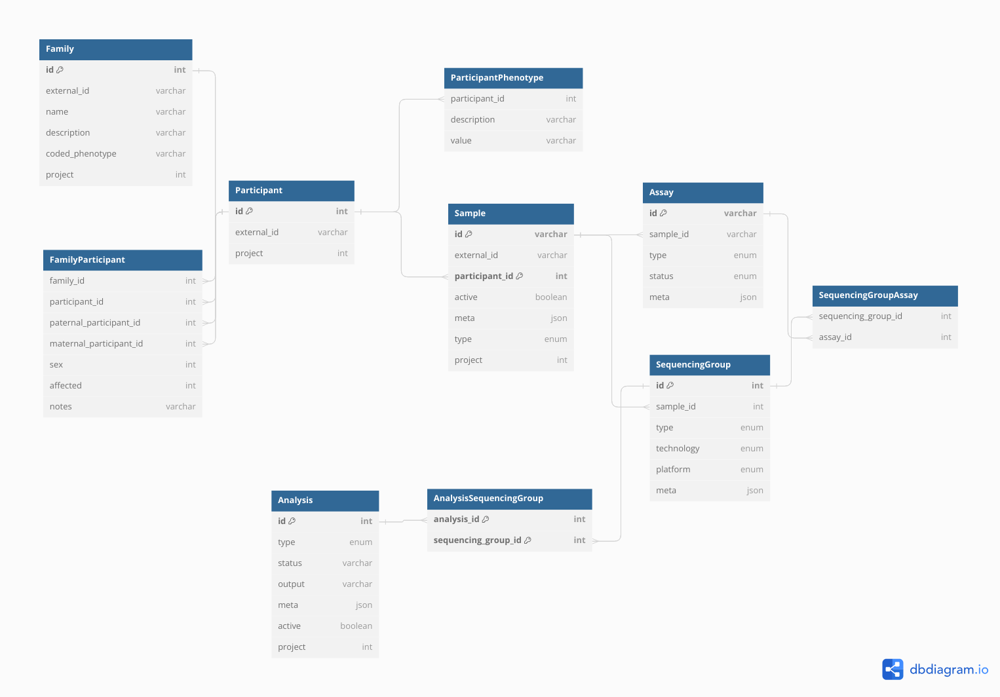

# Introduction

**Metamist** is a database designed for storing de-identified -omics metadata. 

## Purpose

Describe the purpose of the project.

## Features

- **Project-Based Resource Organization**: Every resource in Metamist is associated with a specific project.
- **Access Control**: Access to resources is controlled through membership in specific Google Groups:
  - `dataset-sample-metadata-main-read`: For read-only access.
  - `dataset-sample-metadata-main-write`: For write access.
- **Efficiency Note**: Members of Google Groups are cached in a blob to optimize performance, as group-membership identity lookups can be slow.
 
## High-Level Architecture

It comprises three key components:

1. **System-Versioned MariaDB Database**: A robust database system for managing -omics metadata.

2. **Python Web API**: This component is responsible for:
   - Managing permissions.
   - Storing frequently used queries.
   - Providing a GraphQL API for efficient querying of the database.

3. **Installable Python Library**: Wraps the Python Web API using the OpenAPI generator, facilitating easier interaction with the system.

### Schema

As of Jan 15, 2024 this schema should reflect the data structure on the tables:

You can also find this at [DbDiagram](https://dbdiagram.io/d/Metamist-Schema-v6-6-2-65a48ac7ac844320aee60d16).

The codebase contains the following modules worth noting:

- `models` -> General data models + enums
- `db/python/tables` -> Interaction with MariaDB / BigQuery
- `db/python/layers` -> Business logic
- `api/graphql` : GraphQL
- `api/routes`: HTTP + OpenAPI

And metamist maintains two clients:
- `web`  -> React APP that consumes a generated Typescript API + GraphQL
- `metamist` -> autogenerated Python API