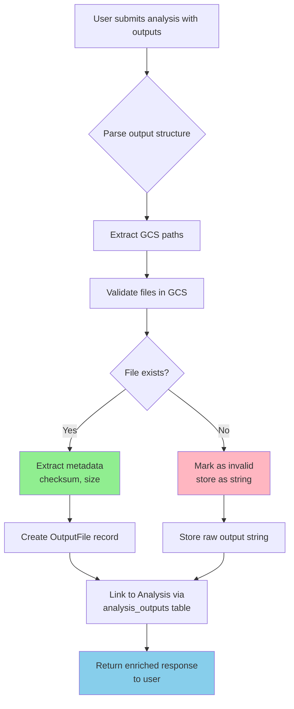
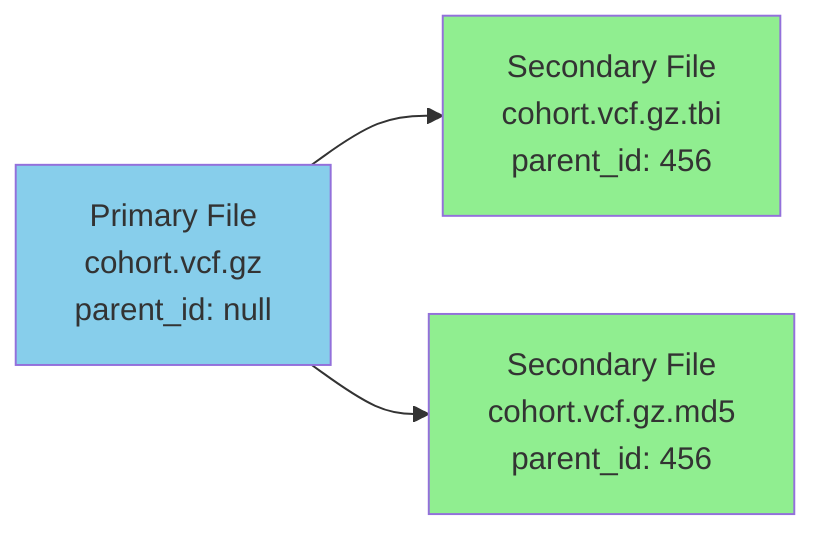
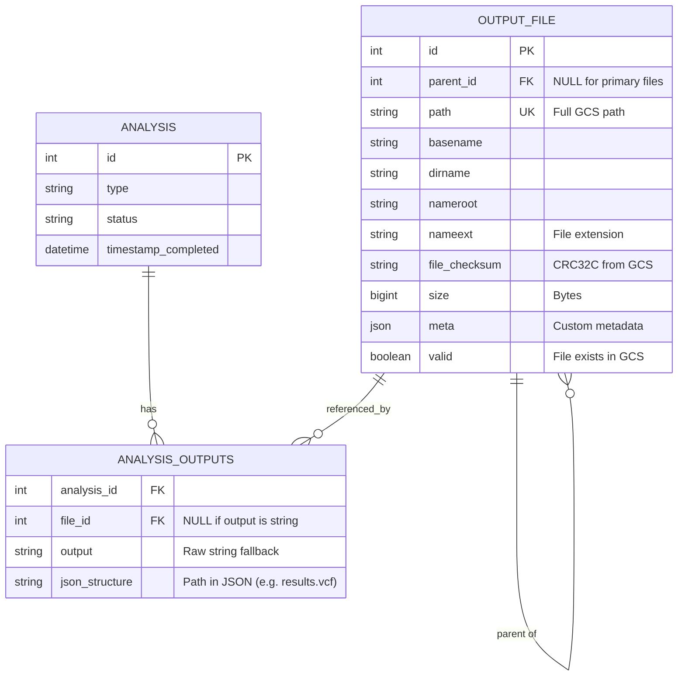

# OutputFile Model Documentation

The OutputFile model in Metamist represents and tracks file outputs from bioinformatics analyses. This system automatically validates files against Google Cloud Storage (GCS), extracts metadata, and manages complex file relationships like VCF files with their index files.

---

## Table of Contents

- [Quick Start](#quick-start)
  - [Upload a Single File](#upload-a-single-file)
  - [Upload a VCF with Index](#upload-a-vcf-with-index)
  - [Understanding the Response](#understanding-the-response)
- [Understanding the Model](#understanding-the-model)
  - [What is an OutputFile?](#what-is-an-outputfile)
  - [Data Flow Overview](#data-flow-overview)
  - [File Validation](#file-validation)
  - [Parent-Child Relationships](#parent-child-relationships)
- [API Usage Guide](#api-usage-guide)
  - [REST API](#rest-api)
  - [GraphQL API](#graphql-api)
  - [Output Structures Comparison](#output-structures-comparison)
  - [Response Format Examples](#response-format-examples)
- [Advanced Patterns](#advanced-patterns)
  - [Complex Nested Structures](#complex-nested-structures)
  - [Handling Invalid Files](#handling-invalid-files)
  - [Secondary Files](#secondary-files)
  - [Special File Types](#special-file-types)
- [Database Schema Reference](#database-schema-reference)
  - [Entity Relationship Diagram](#entity-relationship-diagram)
  - [Table Structures](#table-structures)
  - [Model Fields](#model-fields)

---

## Quick Start

This section gets you started with the most common use cases for OutputFiles in Metamist.

### Upload a Single File

The simplest way to add an output file to an analysis is to include it in the `outputs` field when creating or updating an analysis.

**REST API Example:**

```bash
POST /analysis/{project}/
```

```json
{
  "sequencing_group_ids": ["CPGABC123"],
  "type": "alignment",
  "status": "completed",
  "outputs": {
    "bam": {
      "basename": "gs://my-bucket/results/sample.bam"
    }
  }
}
```

The system will automatically:

- Extract file metadata (size, checksum) from GCS
- Parse the file path into components (directory, filename, extension)
- Validate that the file exists
- Create an OutputFile record linked to your analysis

### Upload a VCF with Index

Use the `secondary_files` field to link companion files such as index files with the VCF:

```json
{
  "sequencing_group_ids": ["CPGABC123"],
  "type": "joint-calling",
  "status": "completed",
  "outputs": {
    "vcf": {
      "basename": "gs://my-bucket/results/cohort.vcf.gz",
      "secondary_files": {
        "index": {
          "basename": "gs://my-bucket/results/cohort.vcf.gz.tbi"
        }
      }
    }
  }
}
```

The index file is tracked as a child via the `parent_id` foreign key.

### Understanding the Response

When you query an analysis, the OutputFile data is returned with full metadata extracted from GCS.

**What you send:**

```json
{
  "outputs": {
    "vcf": {
      "basename": "gs://my-bucket/results/cohort.vcf.gz"
    }
  }
}
```

**What you get back:**

```json
{
  "outputs": {
    "vcf": {
      "id": 456,
      "parent_id": null,
      "path": "gs://my-bucket/results/cohort.vcf.gz",
      "basename": "cohort.vcf.gz",
      "dirname": "gs://my-bucket/results",
      "nameroot": "cohort",
      "nameext": ".vcf.gz",
      "file_checksum": "abc123def456",
      "size": 1024000,
      "meta": null,
      "valid": true,
      "secondary_files": {}
    }
  }
}
```

**Field notes:**

- `id`: Database identifier for the OutputFile record
- `parent_id`: Always `null` for primary files; secondary files omit this field entirely
- `secondary_files`: Always included, even if empty (`{}`)
- `meta`: Custom metadata field, `null` if not set
- `valid`: `true` if file exists in GCS, `false` otherwise

> [!TIP]
> The `valid` field tells you if the file exists in GCS. Files that don't exist will fall back to simple string values in the response.

---

## Understanding the Model

This section explains the conceptual model behind OutputFiles and how they work.

### What is an OutputFile?

An OutputFile represents a single file in Google Cloud Storage that was produced by a bioinformatics analysis. The system tracks:

- **File location**: Full GCS path (`gs://bucket/path/file.ext`)
- **File metadata**: Size, checksum (CRC32C), validity
- **File structure**: Path components for easy querying (basename, directory, extension)
- **Relationships**: Links to parent files (for secondary files like indices)
- **Custom metadata**: Optional JSON field for additional information

Metamist provides two model variants that serve different purposes in the system:

#### Model Comparison

| Aspect | `OutputFile` (Pydantic) | `OutputFileInternal` (SMBase) |
|--------|-------------------------|-------------------------------|
| **Primary Use** | External API interactions | Internal database operations |
| **Base Class** | `BaseModel` (Pydantic) | `SMBase` (Metamist base class) |
| **Where Used** | REST/GraphQL responses, user input | Database queries, business logic, GCS validation |
| **Validation** | Pydantic type validation | Database-level constraints |
| **Serialization** | Automatic JSON serialization | Manual conversion via `to_external()` |
| **Special Methods** | `to_internal()` - converts to internal model | `from_db()` - creates from DB rows; `to_external()` - converts to API model |
| **Default Values** | `valid=False`, `secondary_files={}` | `valid=False`, `secondary_files={}` (Note: in practice, all DB records have `valid=True` since invalid files don't create records) |

**When to use each:**

- **Use `OutputFile`** when:
  - Returning data to API users (REST/GraphQL responses)
  - Accepting user input and need Pydantic validation
  - Serializing to JSON for external consumption

- **Use `OutputFileInternal`** when:
  - Querying the database
  - Performing GCS validation and metadata extraction
  - Implementing business logic that doesn't directly interface with users
  - Need access to database-specific methods like `from_db()`

**Example conversion:**

```python
# API receives Pydantic model, converts to internal for DB operations
external_model = OutputFile(path="gs://bucket/file.vcf", ...)
internal_model = external_model.to_internal()

# Database returns internal model, converts to external for API response
db_row = await fetch_from_db(...)
internal_model = OutputFileInternal.from_db(db_row)
external_model = internal_model.to_external()
```

### Data Flow Overview

The following diagram shows how OutputFile data flows through the system when you create an analysis with outputs:



### File Validation

Every OutputFile is automatically validated against Google Cloud Storage when created or updated.

**Validation Process:**

1. **Existence Check**: Metamist attempts to access the file at the specified GCS path
2. **Metadata Extraction**: If the file exists, GCS metadata is retrieved:
   - **CRC32C Checksum**: For data integrity verification
   - **File Size**: In bytes
3. **Validity Flag**: The `valid` field is set to `true` if the file is accessible, `false` otherwise

**Validation Results:**

| Validation Status | Response Format | Use Case |
|------------------|-----------------|----------|
| ✅ File exists and accessible | Full OutputFile object with `valid: true` | Normal operation |
| ❌ File not found or inaccessible | Simple string (no OutputFile created) | Planned outputs, missing files, permission issues |

> [!NOTE]
>
> **All OutputFiles have `valid: true`**: Because the code returns `None` for any file that fails validation (see `create_or_update_output_file()`), all OutputFile records in the database have `valid: true`. Files that can't be validated simply don't get OutputFile records.
>
> [!CAUTION]
> **Matrix Table (.mt) files** are currently not supported. These Hail-specific files are treated as directories in GCS and cannot be validated using the standard file validation process.

### Parent-Child Relationships

Many bioinformatics file formats require companion files (index files, checksum files, etc.). OutputFile models these as parent-child relationships.



**How it works:**

- **Primary files** have `parent_id = null`
- **Secondary files** reference their primary file via `parent_id`
- In API responses, secondary files are nested under `secondary_files` in their parent's object

> [!NOTE]
> **`parent_id` in API Responses**: The `parent_id` field only appears in **primary files** (where it's set to `null`). Secondary files do **not** include the `parent_id` field in API responses, even though the relationship is tracked in the database via the `parent_id` foreign key.

**Example structure:**

```json
{
  "vcf": {
    "id": 456,
    "parent_id": null,
    "path": "gs://bucket/cohort.vcf.gz",
    "basename": "cohort.vcf.gz",
    "dirname": "gs://bucket",
    "nameroot": "cohort",
    "nameext": ".vcf.gz",
    "file_checksum": "abc123def456",
    "size": 1024000,
    "meta": null,
    "valid": true,
    "secondary_files": {
      "index": {
        "id": 457,
        "path": "gs://bucket/cohort.vcf.gz.tbi",
        "basename": "cohort.vcf.gz.tbi",
        "dirname": "gs://bucket",
        "nameroot": "cohort.vcf.gz",
        "nameext": ".tbi",
        "file_checksum": "def456ghi789",
        "size": 50000,
        "meta": null,
        "valid": true,
        "secondary_files": {}
      }
    }
  }
}
```

---

## API Usage Guide

This section covers how to interact with OutputFiles via REST and GraphQL APIs.

### REST API

OutputFiles are managed indirectly through analysis endpoints. You don't create OutputFiles directly; instead, you include them in the `outputs` field when creating or updating analyses.

**Available Endpoints:**

| Endpoint | Method | Purpose |
|----------|--------|---------|
| `/analysis/{project}/` | `POST` | Create analysis with outputs |
| `/analysis/{analysis_id}/` | `PATCH` | Update analysis outputs |
| `/analysis/{analysis_id}/` | `GET` | Retrieve analysis with outputs |

**Creating an Analysis with Outputs:**

```bash
POST /analysis/{project}/
Content-Type: application/json
```

```json
{
  "sequencing_group_ids": ["CPGABC123"],
  "type": "joint-calling",
  "status": "completed",
  "outputs": {
    "vcf": {
      "basename": "gs://bucket/results/joint.vcf.gz",
      "secondary_files": {
        "index": {"basename": "gs://bucket/results/joint.vcf.gz.tbi"}
      }
    },
    "stats": {
      "basename": "gs://bucket/results/stats.json"
    }
  }
}
```

### GraphQL API

OutputFiles can also be created and queried through GraphQL. The `outputs` field uses a JSON scalar type, accepting the same structure as the REST API.

**Creating an Analysis:**

```graphql
mutation CreateAnalysis(
  $project: String!
  $sequencingGroupIds: [String!]
  $type: String!
  $status: AnalysisStatus!
  $outputs: JSON
) {
  analysis {
    createAnalysis(
      project: $project
      analysis: {
        type: $type
        status: $status
        sequencingGroupIds: $sequencingGroupIds
        outputs: $outputs
      }
    ) {
      id
      status
      outputs
    }
  }
}
```

**Variables:**

```json
{
  "project": "my-project",
  "sequencingGroupIds": ["CPGABC123"],
  "type": "joint-calling",
  "status": "COMPLETED",
  "outputs": {
    "vcf": {
      "basename": "gs://bucket/results/joint.vcf.gz",
      "secondary_files": {
        "index": {"basename": "gs://bucket/results/joint.vcf.gz.tbi"}
      }
    }
  }
}
```

**Querying OutputFiles:**

```graphql
query GetAnalysis($analysisId: Int!) {
  analysis(id: $analysisId) {
    id
    type
    status
    outputs  # JSON scalar - returns entire outputs structure
  }
}
```

> [!NOTE]
> **GraphQL `outputs` field**: The `outputs` field is a `JSON` scalar type, which means you receive the entire JSON structure as a blob. You cannot select individual OutputFile fields within the GraphQL query - you get the complete nested structure with all OutputFile objects and their metadata.

### Output Structures Comparison

You can structure your outputs in different ways depending on your needs. Here's a comparison of the three main patterns:

| Pattern | Structure | Best For | Example |
|---------|-----------|----------|---------|
| **Simple String** (Deprecated) | `"output": "gs://..."` | Legacy compatibility | Single primary file |
| **Single File** | `{"file": {"basename": "gs://..."}}` | One file per analysis | BAM alignment output |
| **Multi-File** | `{"vcf": {...}, "bam": {...}}` | Multiple unrelated files | Pipeline with diverse outputs |
| **Nested Structure** | `{"results": {"filtered": {...}, "raw": {...}}}` | Organized file groups | Multi-stage analysis outputs |
| **With Secondary Files** | `{"vcf": {"basename": "...", "secondary_files": {...}}}` | Files with companions | VCF + index, BAM + BAI |

### Response Format Examples

The format of the response depends on whether the files were successfully validated and created as OutputFile objects.

#### Successful Validation

When files exist in GCS and are successfully validated:

```json
{
  "id": 123,
  "type": "joint-calling",
  "status": "completed",
  "outputs": {
    "vcf": {
      "id": 456,
      "parent_id": null,
      "path": "gs://bucket/results/joint.vcf.gz",
      "basename": "joint.vcf.gz",
      "dirname": "gs://bucket/results",
      "nameroot": "joint",
      "nameext": ".vcf.gz",
      "file_checksum": "abc123def456",
      "size": 1024000,
      "meta": null,
      "valid": true,
      "secondary_files": {
        "index": {
          "id": 457,
          "path": "gs://bucket/results/joint.vcf.gz.tbi",
          "basename": "joint.vcf.gz.tbi",
          "dirname": "gs://bucket/results",
          "nameroot": "joint.vcf.gz",
          "nameext": ".tbi",
          "file_checksum": "def456ghi789",
          "size": 50000,
          "meta": null,
          "valid": true,
          "secondary_files": {}
        }
      }
    }
  }
}
```

#### Invalid Files Fallback

When files don't exist in GCS or can't be accessed, they fall back to simple string values:

```json
{
  "id": 123,
  "type": "test-analysis",
  "outputs": {
    "missing_file": "gs://bucket/nonexistent.txt",
    "valid_file": {
      "id": 458,
      "path": "gs://bucket/exists.txt",
      "valid": true,
      ...
    }
  }
}
```

> [!NOTE]
> The fallback behavior ensures that analyses can be created even when files don't exist yet (e.g., for planned outputs or in-progress analyses).

---

## Advanced Patterns

This section covers more complex usage patterns and edge cases.

### Complex Nested Structures

For pipelines with multiple stages or organized outputs, you can use deeply nested structures. The JSON hierarchy is preserved in the response.

**Input:**

```json
{
  "outputs": {
    "variants": {
      "filtered": {
        "basename": "gs://bucket/filtered.vcf.gz",
        "secondary_files": {
          "index": {"basename": "gs://bucket/filtered.vcf.gz.tbi"}
        }
      },
      "raw": {
        "basename": "gs://bucket/raw.vcf.gz"
      }
    },
    "metrics": {
      "quality": {
        "basename": "gs://bucket/quality.txt"
      },
      "coverage": {
        "basename": "gs://bucket/coverage.txt"
      }
    }
  }
}
```

**Response:**

The full OutputFile objects are nested at the same locations in the JSON structure, preserving your organizational hierarchy.

```json
{
  "outputs": {
    "variants": {
      "filtered": {
        "id": 459,
        "path": "gs://bucket/filtered.vcf.gz",
        "valid": true,
        "secondary_files": {
          "index": {
            "id": 460,
            "path": "gs://bucket/filtered.vcf.gz.tbi",
            "valid": true,
            "secondary_files": {}
          }
        }
      },
      "raw": {
        "id": 461,
        "path": "gs://bucket/raw.vcf.gz",
        "valid": true,
        "secondary_files": {}
      }
    },
    "metrics": {
      "quality": {
        "id": 462,
        "path": "gs://bucket/quality.txt",
        "valid": true,
        "secondary_files": {}
      },
      "coverage": {
        "id": 463,
        "path": "gs://bucket/coverage.txt",
        "valid": true,
        "secondary_files": {}
      }
    }
  }
}
```

### Handling Invalid Files

Files may fail validation for several reasons:

- File doesn't exist yet (planned output, in-progress analysis)
- File was deleted from GCS after analysis completion
- Incorrect GCS path
- File is a Matrix Table (.mt) which is treated as a directory

**Actual Behavior** (based on code in `create_or_update_output_file()`):

- If a file **fails validation** (doesn't exist or can't be accessed), **NO OutputFile record is created**
- Instead, the path is stored as a simple string in `outputs`
- The system does **NOT** create OutputFile objects with `valid: false`

> [!IMPORTANT]
> **Why no `valid: false` OutputFiles?** The code explicitly checks `if not file_obj or not file_obj.valid: return None` in [output_file.py:L80](file:///Users/yaspan/Development/metamist/db/python/tables/output_file.py#L80). This means only files that successfully validate (exist in GCS and are accessible) get OutputFile records.

**Example with mixed valid/invalid files:**

```json
{
  "outputs": {
    "missing_file": "gs://bucket/nonexistent.txt",
    "valid_file": {
      "id": 464,
      "path": "gs://bucket/actual-file.txt",
      "valid": true,
      "secondary_files": {},
      ...
    }
  }
}
```

- `missing_file`: Simple string (file doesn't exist, no OutputFile created)
- `valid_file`: Full OutputFile object (file exists and validated)

### Secondary Files

Secondary files can be nested multiple levels deep and can have their own secondary files.

**Common Secondary File Patterns:**

| Primary File | Secondary Files | Use Case |
|--------------|----------------|----------|
| `.vcf.gz` | `.tbi` or `.csi` | VCF index for fast queries |
| `.bam` | `.bai` or `.csi` | BAM index for IGV/samtools |
| `.cram` | `.crai` | CRAM index |
| `.fasta` | `.fai`, `.dict` | Reference genome indices |
| Any file | `.md5` | Checksum validation |

**Example with multiple secondary files:**

```json
{
  "reference": {
    "basename": "gs://bucket/genome.fasta",
    "secondary_files": {
      "fai": {"basename": "gs://bucket/genome.fasta.fai"},
      "dict": {"basename": "gs://bucket/genome.dict"}
    }
  }
}
```

### Special File Types

Some file types require special handling or have limitations.

#### Matrix Table (.mt) Files

> [!WARNING]
> **Not Currently Supported**: Matrix Table (`.mt`) files used by Hail are stored as directories in GCS, not individual files. The current validation system cannot handle directory-based file formats and will fail validation for `.mt` files.

**Workaround**: Store the `.mt` directory path as a string in the analysis `meta` field rather than in `outputs`:

```json
{
  "type": "hail-analysis",
  "outputs": {
    "summary": {"basename": "gs://bucket/summary.txt"}
  },
  "meta": {
    "matrix_table": "gs://bucket/results/data.mt"
  }
}
```

---

## Database Schema Reference

This section provides technical details about the underlying database schema for developers and database administrators.

### Entity Relationship Diagram

The OutputFile system uses two main tables: `output_file` for storing file metadata, and `analysis_outputs` for linking files to analyses.



**Key Relationships:**

- `OUTPUT_FILE.parent_id` → `OUTPUT_FILE.id`: Self-referencing foreign key for secondary files
- `ANALYSIS_OUTPUTS.analysis_id` → `ANALYSIS.id`: Links files to analyses
- `ANALYSIS_OUTPUTS.file_id` → `OUTPUT_FILE.id`: References the file record
- **Constraint**: In `ANALYSIS_OUTPUTS`, either `file_id` OR `output` must be set (not both, not neither)

### Table Structures

#### output_file Table

Stores metadata for each unique file in GCS. Files are deduplicated by path - the same file referenced by multiple analyses only appears once in this table.

| Column | Type | Constraints | Description |
|--------|------|-------------|-------------|
| `id` | INT | PRIMARY KEY, AUTO_INCREMENT | Unique identifier |
| `path` | VARCHAR(255) | NOT NULL, UNIQUE | Full GCS path (e.g., `gs://bucket/file.txt`) |
| `basename` | VARCHAR(255) | NOT NULL | Filename with extension |
| `dirname` | VARCHAR(255) | NOT NULL | Directory path without filename |
| `nameroot` | VARCHAR(255) | NOT NULL | Filename without extension |
| `nameext` | VARCHAR(25) | NULLABLE | File extension including dot (e.g., `.vcf.gz`) |
| `file_checksum` | VARCHAR(255) | NULLABLE | CRC32C checksum from GCS metadata |
| `size` | BIGINT | NOT NULL | File size in bytes from GCS |
| `meta` | VARCHAR(255) | NULLABLE | JSON string for additional metadata |
| `valid` | BOOLEAN | DEFAULT FALSE | Whether file exists and is accessible in GCS |
| `parent_id` | INT | FOREIGN KEY → output_file(id) | Parent file ID for secondary files |

**Indexes:**

- Primary key on `id`
- Unique index on `path` for fast lookups and deduplication
- Foreign key index on `parent_id` for parent-child queries

#### analysis_outputs Table

Join table linking analyses to their output files. Tracks the position of each file in the JSON structure.

| Column | Type | Constraints | Description |
|--------|------|-------------|-------------|
| `analysis_id` | INT | FOREIGN KEY → analysis(id), NOT NULL | Analysis that produced this output |
| `file_id` | INT | FOREIGN KEY → output_file(id), NULLABLE | Reference to OutputFile record |
| `output` | VARCHAR(255) | NULLABLE | Raw output string (fallback for invalid files) |
| `json_structure` | VARCHAR(255) | NULLABLE | Path in output JSON (e.g., `"variants.filtered"`) |

**Constraints:**

- `(file_id IS NOT NULL AND output IS NULL) OR (file_id IS NULL AND output IS NOT NULL)`: Exactly one of `file_id` or `output` must be set
- Composite foreign key on `(analysis_id, file_id)` for efficient joins

### Model Fields

#### OutputFileInternal

Used for internal database operations and business logic.

```python
class OutputFileInternal(SMBase):
    """Internal model for OutputFile database operations"""

    id: int | None = None                    # Database primary key
    parent_id: int | None = None             # Parent file for secondary files
    path: str                                # Full GCS path (unique)
    basename: str                            # Filename with extension
    dirname: str                             # Directory path
    nameroot: str                            # Filename without extension
    nameext: str | None                      # File extension (.vcf.gz, .bam, etc.)
    file_checksum: str | None                # CRC32C checksum from GCS
    size: int                                # File size in bytes
    meta: dict | None = None                 # Additional metadata (JSON)
    valid: bool = False                      # File validity status
    secondary_files: dict | None = {}        # Secondary files mapping (not stored in DB)
```

#### OutputFile (Pydantic)

Used for external API interactions (REST and GraphQL).

```python
class OutputFile(BaseModel):
    """External Pydantic model for API responses"""

    id: int | None
    parent_id: int | None
    path: str
    basename: str
    dirname: str
    nameroot: str
    nameext: str | None
    file_checksum: str | None
    size: int
    meta: dict | None
    valid: bool
    secondary_files: dict | None
```

**Key Differences:**

| Aspect | OutputFileInternal | OutputFile |
|--------|-------------------|------------|
| Base class | `SMBase` (database model) | `BaseModel` (Pydantic) |
| Purpose | Internal operations | API responses |
| Validation | Database-level | Pydantic validation |
| Default values | `valid=False`, `secondary_files={}` | No defaults |
